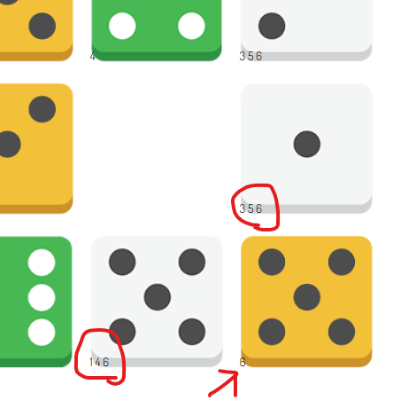

# diceleのヘルパプラグイン

**ゲーム崩壊レベルで簡単になってしまうので技術的興味以外で使用するの非推奨**

https://dicele.com/ 

の解法アルゴリズムを考えてみるためだけに作ったもの。
Chromeのデベロッパーモードで取り込めばdicele.comで使える。

そのセルに入る数字の候補が表示される。

## やってること

- 各セルに数字候補`[1,2,3,4,5,6]`を持つ
- 黄色ダイスだったら自セルの候補からダイスの目を削除
- 白ダイスだったら自身の縦横セルの候補からダイスの目を削除
- 行列それぞれで合計のヒントを元に
  - `ヒント - 緑ダイスの目の合計` と 緑以外のダイスの数を使って残りの出目リストを作る
    - https://qiita.com/qyen/items/8f98428c0f0c144c5003
  - 出目リストに出てこない目は行列のセルでは不要なので候補から削除
- MutationObserver使ってドラッグドロップと面の変更を感知して再処理

あたり。

出目リストを元にもう少し畳み込めそうだけどとりあえずここまで。

